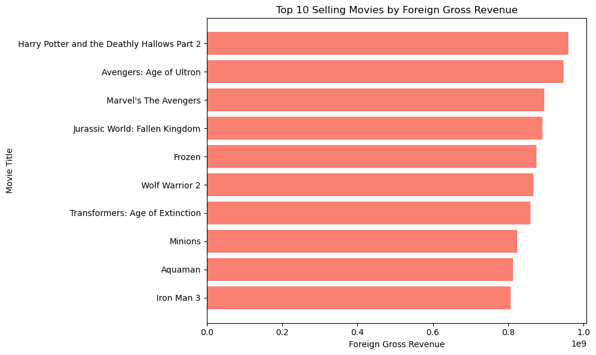
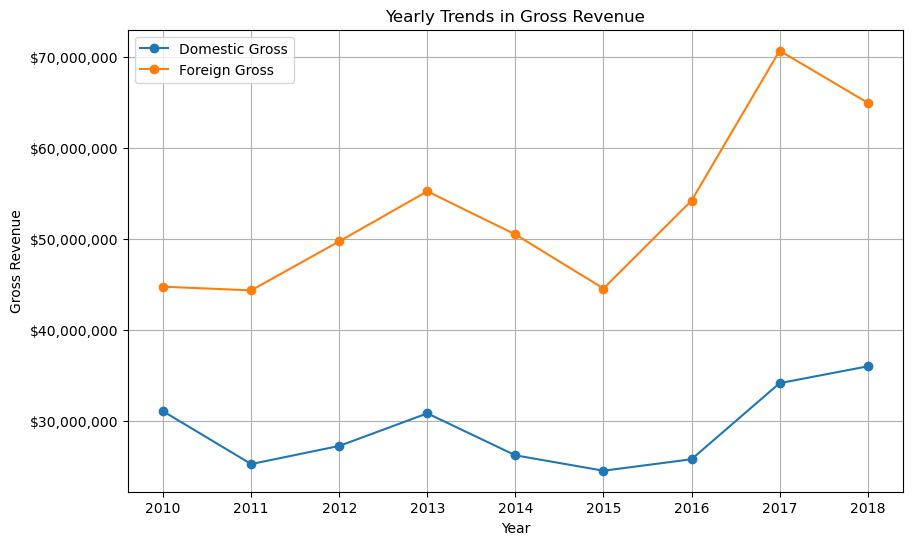
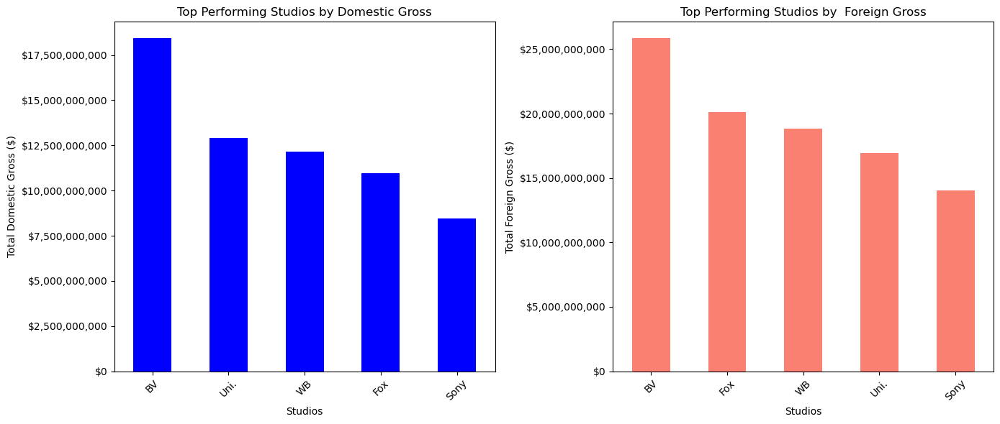
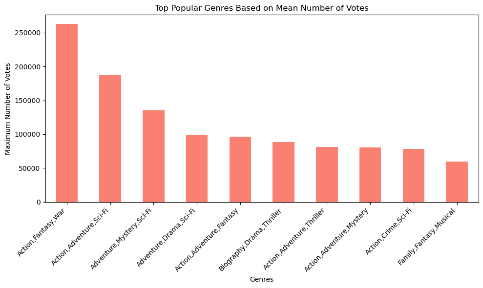

## Movie Studio Project

### **Repository Contents**
The repository contains

    -README.MD - Has project visuals & recommendations
    -presentation.pdf - Microsoft Studio PPT
    -Data - Folder has dataset used in the analysis
    -images - Contains the visualations of the findings.

### **Introduction**
Movie analysis seeks to uncover the types of movies that are doing best in the movie industry.  The analysis aids in understanding the movie industry on the type of genres, best-performing studios, and revenue performance both in domestic and foreign markets, shedding light on the audience behavior, and  insights on the ropes Microsoft to follow in starting a movie studio 
### **Application**
For Microsoft's venture into the movie industry, exploratory data analysis (EDA) is key in generating insights beneficial to Microsoft Team. To establish a successful movie studio, understanding prevalent trends in the film industry is crucial.

### **Business Problem**

Microsoft intends to establish a new movie studio but needs to gain expertise in movie production. The objective is to explore and understand the prevailing trends in successful movies at the box office. This exploration is pivotal in providing actionable insights to guide the decision-making process for the Head of Microsoft's new movie studio.

### **Method**

Use of exploratory data analysis techniques, this project will analyze box office data and IMDB to identify trends and patterns in successful movie genres, domestic and foreign gross correlations, audience preferences, and Studio Revenue Performance. Insights from this analysis will guide strategic decisions regarding the types of films to 
produce.
To understand the type of movies that are best performing at the Box Office , the analysis will review the features that may lead to their success
        -Genre
        -Number of Votes
        -Domestic and Foreign Gross Revenue

### **Data Understanding and Analysis**
The analysis use datasets from

    -Box Office Mojo CSV files
    -IMDB

From the data im.db has the a database with 8 tables contains movie ratings, directors,writers,persons.

Box Office **.csv** format has column of studio, movies produced, and gross revenue.
This information guides to understand the type of movies that are doing well in the movie industry.

## **Expectations**
The expectations of this analysis will be translated into actionable insights, enabling Microsoft's movie studio to make informed decisions regarding the types of movies to create. Insights gleaned from the data will play a pivotal role in formulating a successful strategy for Microsoft to enter and excel in the competitive movie industry.
This format aligns the business problem, analysis, and the project's expectatons for the establishment of a new Microsoft movie studio.

### Analysis Results
For the analysis we will narrow to the following key areas
 - Top Selling Movies as per Foreign Gross
 - Yearly Foreign and Domestic Gross Trend
 - Top Performing Studios
 - Scatter Plot Domestic Gross vs Foreign Gross (Relationship)
 - Top Popular Genre

#### **Top Selling Movies as per Foreign Gross**

#### **Year Foreign and Domestic Gross Trend**

#### **Top Performing Studios**

#### **Scatter Plot for Domestic vs Foreign Gross**

#### **Top Popular Genre**

# Conclusion

**Insights from Top Movies**

By adapting themes similar to those of the top-selling films, Microsoft studio can better resonate with audience preferences and capture their attention effectively. Understanding and incorporating these themes into movie narratives aligns with the successful trends observed in the industry's highest-grossing films.
The emphasis on refining visual elements akin to those prevalent in the most successful movies offers an opportunity for Microsoft's movies to elevate their appeal. Employing cutting-edge visual technologies and techniques can significantly enhance audience engagement and interest, establishing a stronger connection with viewers.

**Gross Revenue Analysis:**

The analysis highlights a consistent trend where the foreign market consistently generates revenues exceeding $40M, while the domestic market struggles to attain this benchmark. Addressing this revenue disparity requires a strategic approach focused on balancing marketing budgets between the domestic and foreign markets. Allocating resources proportionately to match the strategies employed in the foreign market could help bridge the revenue gap, potentially leading to enhanced domestic earnings.

**Collaborations with Studios:**

Collaborations with established studios offer invaluable opportunities, granting access to top-tier talent and a reservoir of creative expertise. This collaboration fosters a creative synergy that could significantly enhance the quality of Microsoft's movie productions.
Implementing profit-sharing models in partnerships can mitigate risks, encourage collaborative efforts, and simultaneously bolster brand visibility. This strategy of shared success incentivizes both parties to work towards mutual goals, ensuring a win-win situation for everyone involved.

**Genre-Centric Recommendations:**

An emphasis on crafting narratives centered around adventurous and thrilling experiences across various movie genres provides a strategic direction for Microsoft's studio. Incorporating these thematic elements aligns with audience preferences, potentially captivating diverse viewer segments.
Incorporating action scenes across a spectrum of movie genres represents a strategic move to establish Microsoft's movie studio as more relevant and appealing to a broader demographic. This strategy aims to cater to a wide array of audience preferences within the cinematic landscape.

**Strategic Marketing Approach:**

A well-defined strategic marketing approach is pivotal for Microsoft's movie studio venture. 
Collaborating with media houses and influencers could serve as a catalyst for expanding audience engagement. 
Leveraging influencers to generate hype and anticipation around new movie releases has the potential to significantly amplify audience reach and engagement.

